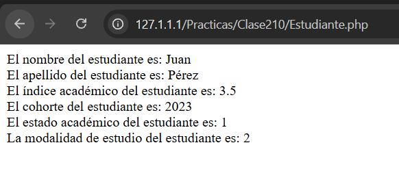
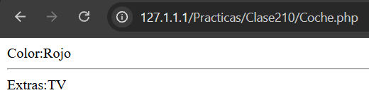
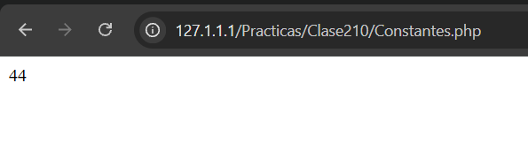
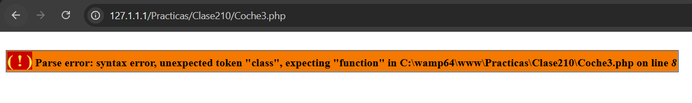
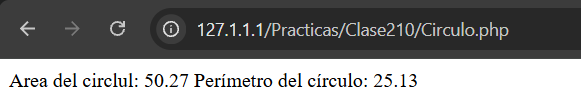

# Universidad Tecnológica de Panamá
## Facultad de Ingeniería de Sistemas Computacionales

**Fecha de Ejecución:** 02 de octubre de 2026

# Objetivos

- Comprender los conceptos fundamentales de la Programación Orientada a Objetos (POO) utilizando PHP.
- Aplicar clases, objetos, herencia y encapsulamiento.
- Comprender el funcionamiento de constructores, métodos y modificadores de acceso.
- Identificar el uso de `static`, `self`, `parent`, `final`, constantes y `traits`.
- Practicar los conceptos mediante ejercicios y comprobar sus resultados.

# Introducción

PHP permite trabajar con el paradigma de Programación Orientada a Objetos (POO), facilitando la organización del código mediante clases y objetos.

En este laboratorio se realizaron diferentes ejercicios para comprender cómo funcionan la herencia, el encapsulamiento, los constructores, los métodos estáticos, las constantes y los traits. También se realizaron operaciones matemáticas mediante una clase para calcular el área y el perímetro de un círculo.

# Requisitos Previos

### Tecnologías utilizadas

- PHP
- Servidor web Apache
- XAMPP / WampServer
- Visual Studio Code
- Sistema operativo Windows 10 / 11

# Desarrollo de los ejercicios

## 1. Clase Persona

Se creó la clase `Persona` con los atributos nombre, apellidos y fecha de nacimiento. Se utilizó un constructor para inicializar los datos y métodos `get` para acceder a la información.

**Archivo:** `Persona.php`

---

## 2. Herencia con la clase Estudiante

Se creó la clase `Estudiante`, que hereda de `Persona` y agrega atributos como índice académico, cohorte, estado académico y modalidad de estudio. Se utilizó `extends` para establecer la herencia y `parent::__construct()` para inicializar los datos heredados.

**Archivo:** `Estudiante.php`

### Resultado

---

## 3. Uso de Traits

Se creó el trait `Modelo`, que contiene un método relacionado con el modelo de un coche. Después, se incorporó mediante `use` en la clase `Ventas`, que también hereda de `Coche`.

Este ejercicio permite observar cómo se pueden reutilizar funcionalidades mediante traits.

**Archivo:** `EjemploTraits.php`

---

## 4. Métodos estáticos y `self`

Se trabajó con las clases `A` y `B`, utilizando métodos estáticos y herencia. Mediante `self::` se llamó a un método definido dentro de la clase padre, observando su comportamiento al redefinir ese método en la clase hija.

**Archivo:** `EjemploLateStatic.php`

### Resultado

---

## 5. Herencia y sobrescritura de métodos

Se creó la clase `Coche` con el atributo protegido `color` y posteriormente la clase `CocheDeLujo`, que hereda sus características y agrega el atributo `extras`.

También se sobrescribió el método `printCaracteristicas()` para mostrar las características del vehículo.

**Archivo:** `Coche.php`

### Resultado

---

## 6. Constantes de clase

Se declaró la constante `RUEDAS` dentro de la clase `Coche`, asignándole el valor `4`. Se comprobó cómo acceder a ella mediante el operador `::`, tanto desde la clase como desde un objeto.

**Archivo:** `Constantes.php`

### Resultado

---

## 7. Clases finales (`final`)

Se utilizó la palabra reservada `final` para declarar la clase `Coche`. Después, se intentó crear una clase hija mediante `extends`, lo que provoca un error fatal porque una clase final no puede heredarse.

**Archivo:** `Coche3.php`

### Resultado

---

## 8. Cálculo del área y perímetro de un círculo

Se creó la clase `Circulo` con un atributo privado llamado `radio`. Mediante el constructor se inicializa el valor y, con los métodos `calcularArea()` y `calcularPerimetro()`, se realizan los cálculos correspondientes.

Se utilizó `M_PI` para representar el valor de pi y `number_format()` para presentar los resultados con dos decimales.

**Archivo:** `Circulo.php`

### Resultado

---

# Conceptos aprendidos

Durante el laboratorio se trabajaron diferentes conceptos de POO en PHP:

- **Clases y objetos:** permiten organizar los datos y funcionalidades.
- **Encapsulamiento:** controla el acceso a los atributos mediante `private` y `protected`.
- **Herencia:** permite crear clases hijas a partir de clases existentes.
- **Constructores:** inicializan los atributos de los objetos.
- **Métodos estáticos:** permiten llamar métodos sin crear una instancia.
- **`self` y `parent`:** permiten referenciar métodos de la propia clase y de la clase padre, respectivamente.
- **Constantes:** permiten definir valores asociados a una clase.
- **Traits:** facilitan la reutilización de métodos.
- **`final`:** impide que una clase pueda ser heredada.

# Dificultades y soluciones

Durante los ejercicios fue importante distinguir el funcionamiento de `self` y `parent`, especialmente al trabajar con herencia. También se tuvo que considerar la diferencia entre los modificadores de acceso `private` y `protected`.

Otro aspecto importante fue comprender que una clase declarada como `final` no puede ser heredada, por lo que intentar hacerlo genera un error fatal.

# Conclusión

En este laboratorio pude reforzar los conceptos básicos de la Programación Orientada a Objetos utilizando PHP. Mediante los ejercicios comprendí mejor cómo funcionan las clases, los objetos, la herencia y el encapsulamiento.

También pude practicar el uso de métodos estáticos, constantes, traits y clases finales. En general, la práctica me ayudó a comprender cómo organizar y reutilizar código mediante la POO.

# Referencias

- PHP. (s. f.). *PHP: Hypertext Preprocessor*. [https://www.php.net/](https://www.php.net/)
- PHP. (s. f.). *Classes and Objects*. [https://www.php.net/manual/en/language.oop5.php](https://www.php.net/manual/en/language.oop5.php)
- PHP. (s. f.). *Object Inheritance*. [https://www.php.net/manual/en/language.oop5.inheritance.php](https://www.php.net/manual/en/language.oop5.inheritance.php)
- PHP. (s. f.). *Traits*. [https://www.php.net/manual/en/language.oop5.traits.php](https://www.php.net/manual/en/language.oop5.traits.php)

# Información del Estudiante

**Nombre:** Vasti Legaspi  
**Correo:** vasti.legaspí@utp.ac.pa  
**Curso:** Desarrollo WEB  
**Instructor:** Irina Fong
